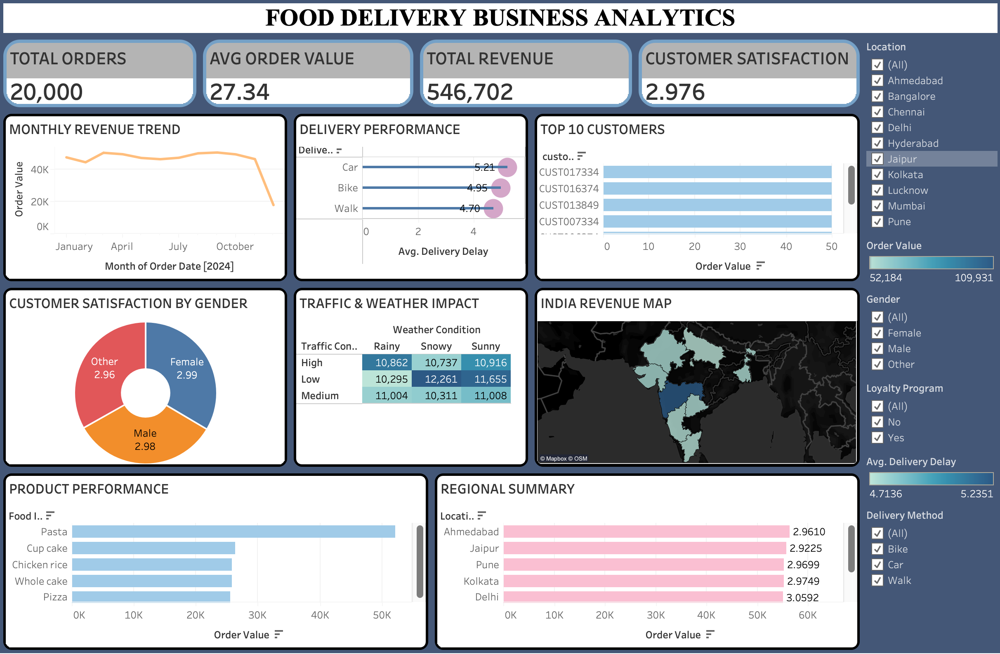
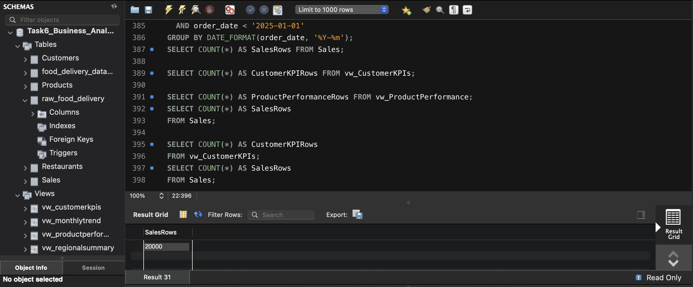
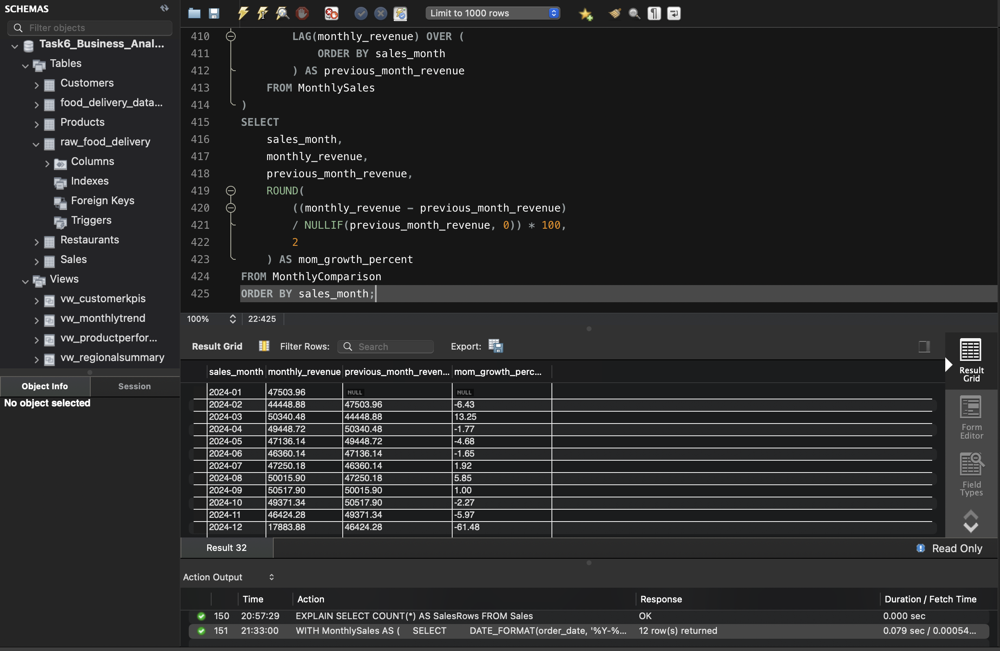

# Food Delivery Business Analytics

## Project Overview

This project is an end-to-end Business Analytics and Business Intelligence solution built using a food delivery dataset containing 20,000 orders from 2024.

The project transforms raw food delivery data into a normalized relational database, applies advanced SQL analytics, creates reporting views and a stored procedure, and connects the database to Tableau for an interactive executive dashboard.

The project demonstrates practical skills in SQL, database normalization, business analytics, data visualization, performance optimization, and dashboard development.

## Executive Dashboard

The final Tableau dashboard provides an executive-level view of food delivery business performance, including revenue, orders, customer satisfaction, delivery performance, product performance, regional performance, and operational factors.



## Technology Stack

MySQL

Tableau Desktop

SQL

CSV Dataset

GitHub

## Dataset

The original dataset contains 20,000 food delivery orders and includes information related to:

Order details

Customers

Restaurants

Food items

Order value

Order and delivery dates

Delivery distance

Delivery method

Traffic conditions

Weather conditions

Delivery delays

Customer satisfaction

Customer ratings

Food quality

Packaging quality

Route efficiency

Customer preferences

## Project Architecture

The project follows a structured data pipeline from raw data to business intelligence reporting.


The overall flow is:

Raw Food Delivery Dataset

MySQL Database

Normalized Relational Tables

Advanced SQL Analytics

Reporting Views

Tableau

Executive Business Dashboard

## Database Design

The raw dataset was first imported into a staging table and then transformed into a normalized relational structure.

### Main Tables

Customers

Stores customer demographic information, preferences, loyalty information, ratings, and satisfaction.

Products

Contains unique food items used in the sales transactions.

Restaurants

Contains restaurant identifiers.

Sales

Contains order-level transaction and delivery information.

raw_food_delivery

Staging table containing the original imported dataset.



## Reporting Views

Four reporting views were created as required for business reporting.

### vw_CustomerKPIs

Provides customer-level order, revenue, average order value, and satisfaction metrics.

### vw_MonthlyTrend

Provides monthly order volume, revenue, and average order value for trend analysis.

### vw_ProductPerformance

Provides product-level order volume, revenue, average order value, customer satisfaction, and food freshness metrics.

### vw_RegionalSummary

Provides regional order volume, revenue, average order value, customer satisfaction, and delivery delay metrics.

## Advanced SQL Analytics

The project uses advanced SQL techniques to support business analysis.

The implemented techniques include:

RANK

DENSE_RANK

LAG

LEAD

Common Table Expressions

Subqueries

Month-over-Month revenue analysis

Top customer analysis

Regional customer ranking

The following analysis compares monthly revenue with the previous month and calculates month-over-month growth.



## Stored Procedure

A stored procedure named `sp_MonthlySummary` was created to generate a monthly business summary.

The procedure accepts a month in `YYYY-MM` format and returns:

Total orders

Total revenue

Average order value

Average delivery delay

Average customer satisfaction

Example execution:

```sql
CALL sp_MonthlySummary('2024-01');


## Published Tableau Dashboard

[View the live Tableau Public Dashboard](https://public.tableau.com/app/profile/subham.kumar7465/viz/Food_Delivery_Business_Analytics_Portable/ExecutiveBusinessAnalyticsDashboard?publish=yes)
